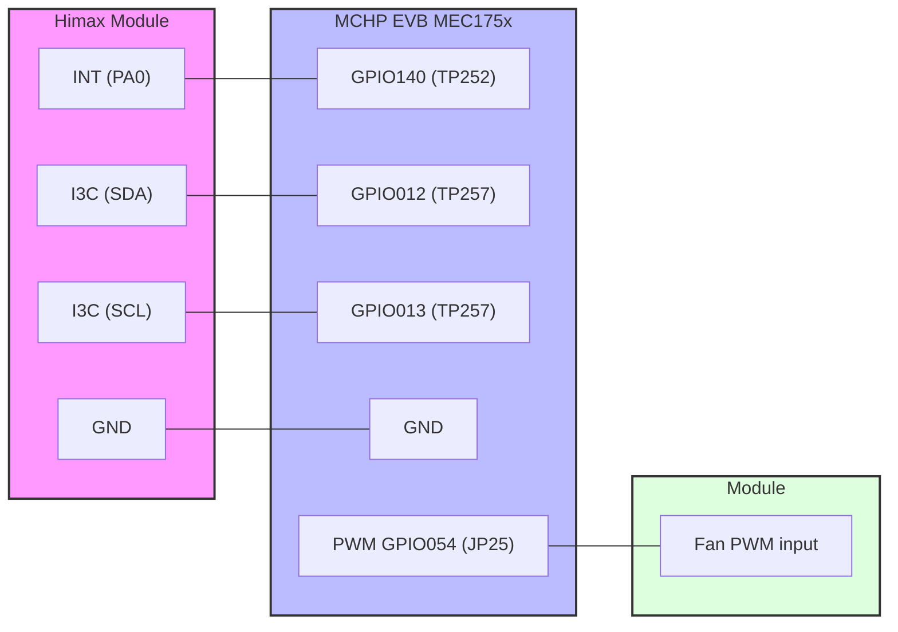

# Himax Demo

## Zephyr toolchain
Windows Minimal: [link](https://github.com/zephyrproject-rtos/sdk-ng/releases/download/v0.16.8/zephyr-sdk-0.16.8_windows-x86_64_minimal.7z)

arm-zephyr-eabi: [link](https://github.com/zephyrproject-rtos/sdk-ng/releases/download/v0.16.8/toolchain_windows-x86_64_arm-zephyr-eabi.7z)


## SDK install
```
tools\script\install.bat
``` 

## Setup
```
tools\script\setup.bat
```

## Build
```
west build -p -b ec_card/mec1753_qsz app
```

## Flash
```
cd tools\KF_JLINK_Flash_Utility_L0100
python kf_flsh_util.py -w -f ..\..\build\zephyr\spi_image.bin
```


## Connect

MCHP EVB: modules\app\boards\microchip\ec_card\doc\MEC1753-240 Evaluation Board.PDF

Himax EVB: tools\himax

|Himax 端訊號|MCHP EVB 端位置|備註|
|:---:|:---:|:---:|
|INT (PA0)|GPIO140 (TP252)|中斷訊號線|
|I3C (SDA)|GPIO012 (TP257)|數據線|
|I3C (SCL)|GPIO013 (TP257)|時鐘線|
|GND|GND|共地|
|---|GPIO054 (JP25),輸出至風扇|PWM|
||||


